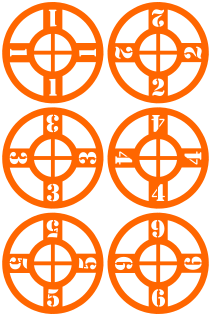
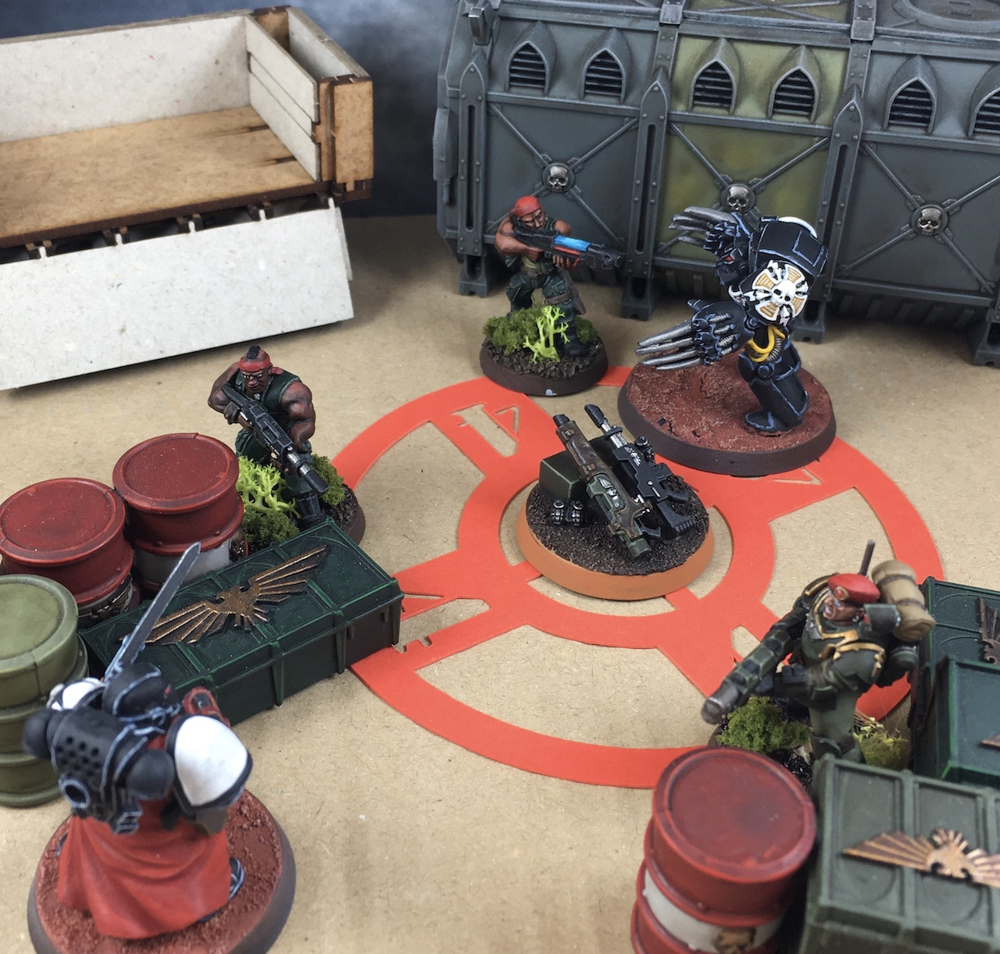

Kill Team objective marker rings
================================

This is a set of numbered objective marker rings for Kill Team in SVG format.
They show the area of control for objectives directly on the battlefield, and
eliminate the need for measuring.

How to use them
---------------

Place the rings where your objective markers go for the mission, underneath any
scatter terrain. If you're using objective marker models, place them on top in
the centre.

During play, any model touching the marker ring is within the area of control.
If you're playing a mission where models need to be within 1" of the objective
marker, then any model touching the inner ring is close enough.

 

The rules
---------

An excerpt from the rules about objective markers:

> Whenever you measure to or from an objective marker, unless stated otherwise
> measure to the centre of the marker, and when measuring to another objective
> marker or the edge of the battlefield, only measure the horizontal distance.
> A player controls an objective marker if there are more models from their
> kill team within 2" of it than there are enemy models.
>
> -- <cite>Kill Team Core Manual, page 48</cite>

And an excerpt from the rules about measuring distances:

> Distances in Kill Team are measured in inches (") between the closest points
> of the bases of the models you’re measuring to and from. An object (such as a
> model) is said to be within a certain range (e.g. 6") of something if the
> distance to that thing is that range or less. So, for example, a model is
> within 6" of another model as long as it is 6" or less from that model. If a
> model does not have a base, measure to and from the closest point of that
> model instead. You can measure distances whenever you wish.
>
> -- <cite>Kill Team Core Manual, page 16</cite>

The relevant conclusions from the extracts above are:

- You measure to the centre of the objective marker, but from the edge of a
  model's base. As this ring has a 2" radius, any model whose base is touching
  it is at most 2" away from the centre of the ring.
- You can measure at any time, which would include pre-measuring. Making
  distances evident on the battlefield itself only enables what is already
  permitted.

How to make them
----------------

I cut them out on a Cricut programmable die cutter, using 270gsm card. If you
don't have a die cutter, you could print them out as a template and cut them
from whatever material you fancy.

I think you could probably 3d print them too, if you gave them some depth. If
you do that, and can get a nice photo of it, then please send it to me so I can
include it here.

Licence and reuse
-----------------

 Kill Team objective marker rings by <a xmlns:cc="http://creativecommons.org/ns#" href="https://github.com/evilstreak/kill-team-objective-marker-rings" property="cc:attributionName" rel="cc:attributionURL">Dominic Baggott</a> is licensed under a <a rel="license" href="http://creativecommons.org/licenses/by-sa/4.0/">Creative Commons Attribution-ShareAlike 4.0 International License</a>.

If you want to reuse these markers for another game system, please go ahead! If
you share the files online let me know and I can include a link from here.
